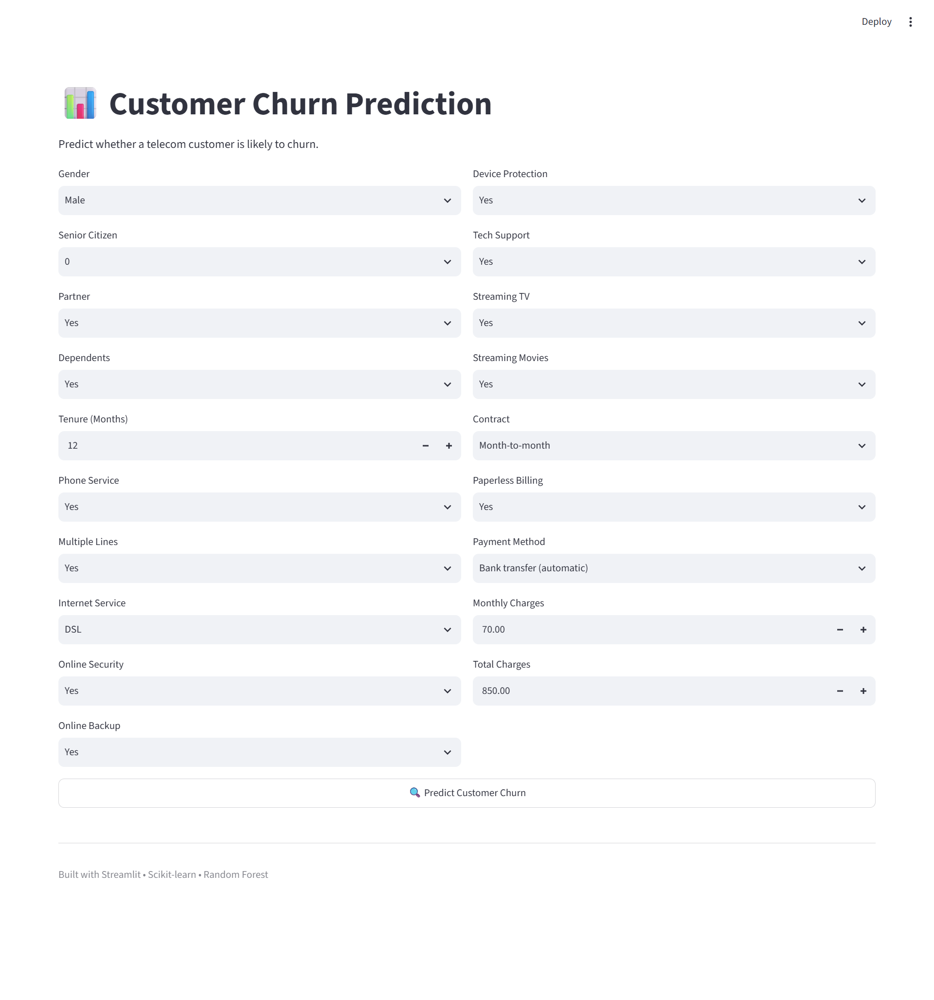

# 📊 Customer Churn Prediction using Machine Learning
This project predicts whether a telecom customer is likely to churn using Machine Learning techniques.

The project includes:

- Data Cleaning
- Exploratory Data Analysis (EDA)
- Feature Engineering
- Logistic Regression
- Random Forest
- Hyperparameter Tuning using GridSearchCV
- Streamlit Web Application

## 📌 Project Overview

Customer churn is one of the biggest challenges faced by telecom companies. Losing existing customers increases business costs because acquiring a new customer is usually more expensive than retaining an existing one.

The goal of this project is to build a Machine Learning model that predicts whether a customer is likely to leave the telecom service based on customer demographics, account information, and service usage.

The trained model is deployed using Streamlit, allowing users to enter customer details and instantly predict whether the customer is likely to churn.
## 📂 Dataset Information

| Attribute | Details |
|-----------|---------|
| Dataset Name | IBM Telco Customer Churn |
| Total Records | 7,043 |
| Records After Cleaning | 7,032 |
| Features | 20 (after removing `customerID`) |
| Target Variable | Churn |
| Problem Type | Binary Classification |

### Target Variable

- **Yes (1)** → Customer is likely to churn.
- **No (0)** → Customer is likely to stay.

### Dataset Description

The dataset contains customer demographic information, account details, subscribed services, billing information, and customer status. The objective is to predict whether a customer will leave the telecom company.
## 🔄 Project Workflow

```text
Customer Dataset
        │
        ▼
Data Cleaning
(Remove missing values, convert data types)
        │
        ▼
Exploratory Data Analysis (EDA)
        │
        ▼
Feature Engineering
(Label Encoding + One-Hot Encoding)
        │
        ▼
Train-Test Split
(80% Train | 20% Test)
        │
        ▼
Feature Scaling
(StandardScaler)
        │
        ▼
Model Training
├── Logistic Regression
└── Random Forest
        │
        ▼
Hyperparameter Tuning
(GridSearchCV)
        │
        ▼
Model Evaluation
Accuracy • Precision • Recall • F1-Score
        │
        ▼
Save Model (.pkl)
        │
        ▼
Streamlit Web Application
```
## 🛠️ Technologies Used

| Category | Technologies |
|----------|--------------|
| Programming Language | Python 3.11 |
| IDE | VS Code, Jupyter Notebook |
| Data Manipulation | Pandas, NumPy |
| Data Visualization | Matplotlib, Seaborn |
| Machine Learning | Scikit-learn |
| Models | Logistic Regression, Random Forest |
| Hyperparameter Tuning | GridSearchCV |
| Deployment | Streamlit |
| Model Serialization | Joblib |
| Version Control | Git & GitHub |
## 📊 Exploratory Data Analysis (EDA)

During the Exploratory Data Analysis (EDA) phase, the dataset was analyzed to understand its structure, identify missing values, detect duplicates, and study customer churn patterns.

### Data Cleaning Performed

- Converted `TotalCharges` from object to numeric datatype.
- Removed rows with missing values.
- Removed the `customerID` column because it does not contribute to prediction.
- Verified that no duplicate records were present.

### Key Observations

- The dataset contains **7,043** customer records.
- After cleaning, **7,032** records remained.
- Most customers did **not** churn.
- Customers with **Month-to-Month contracts** showed a higher churn rate.
- Customers with **Fiber Optic Internet** had a higher probability of churning.
- Customers with **short tenure** were more likely to churn than long-term customers.
### Visualizations

The following visualizations were created during EDA:

- Customer Churn Distribution
- Contract Type Distribution
- Internet Service Distribution
- Monthly Charges Distribution
- Correlation Heatmap
### Customer Churn Distribution


## ⚙️ Data Preprocessing & Feature Engineering

To prepare the dataset for Machine Learning, several preprocessing techniques were applied.

### 1. Handling Missing Values

- Converted the `TotalCharges` column from object to numeric using `pd.to_numeric()`.
- Removed rows containing missing values using `dropna()`.

### 2. Removing Unnecessary Features

- Dropped the `customerID` column because it is only a unique identifier and does not contribute to prediction.

### 3. Encoding Categorical Features

The dataset contained several categorical columns.

Two encoding techniques were used:

- **Label Encoding**
  - Applied to the target column (`Churn`).
  - Converted:
    - `Yes → 1`
    - `No → 0`

- **One-Hot Encoding**
  - Applied to all input categorical features.
  - Used `drop_first=True` to avoid the Dummy Variable Trap.

### 4. Train-Test Split

The dataset was divided into:

- **Training Data:** 80%
- **Testing Data:** 20%

using `train_test_split()` with `random_state=42`.

### 5. Feature Scaling

Numerical features:

- Tenure
- MonthlyCharges
- TotalCharges

were standardized using **StandardScaler**.

The scaler was fitted only on the training data and then applied to the testing data to prevent data leakage.
## 🤖 Model Building & Performance

Two Machine Learning algorithms were trained and evaluated for customer churn prediction.

### Model 1: Logistic Regression

Logistic Regression was selected as the baseline model because it is simple, fast, and easy to interpret.

**Performance**

| Metric | Value |
|---------|------:|
| Accuracy | 78.68% |
| Precision | 62% |
| Recall | 51% |
| F1-Score | 56% |

---

### Model 2: Random Forest Classifier

Random Forest was used because it can capture complex relationships between features and generally performs better than a single decision tree.

Hyperparameter tuning was performed using **GridSearchCV** to obtain the best model.

**Best Hyperparameters**

```python
{
    'max_depth': 10,
    'min_samples_leaf': 2,
    'min_samples_split': 2,
    'n_estimators': 300
}
```

**Performance**

| Metric | Value |
|---------|------:|
| Accuracy | 79.53% |
| Precision | 66% |
| Recall | 48% |
| F1-Score | 56% |

---

## 📈 Model Comparison

| Model | Accuracy |
|--------|---------:|
| Logistic Regression | 78.68% |
| Random Forest (Tuned) | **79.53%** |

Although Random Forest achieved a slightly higher overall accuracy, Logistic Regression achieved a better recall for churn prediction. Since identifying customers who are likely to churn is important for business decisions, recall was carefully analyzed along with accuracy before selecting the final model.
## 📈 Project Results & Business Insights

### Project Results

The final Random Forest model achieved an accuracy of **79.53%** on the test dataset after hyperparameter tuning using GridSearchCV.

The model successfully predicts whether a customer is likely to churn based on customer demographics, account details, and subscribed services.

---

### Business Insights

The analysis revealed several important patterns that can help telecom companies reduce customer churn.

- Customers with **Month-to-Month contracts** are more likely to churn.
- Customers with **short tenure** have a higher probability of leaving the company.
- Customers using **Fiber Optic Internet Service** showed a higher churn rate.
- Customers with **higher monthly charges** were more likely to churn.
- Long-term customers with **One-Year or Two-Year contracts** were less likely to churn.

---

### Business Value

Using this prediction model, a telecom company can:

- Identify customers who are at high risk of churning.
- Offer personalized discounts or loyalty plans.
- Improve customer retention strategies.
- Reduce revenue loss caused by customer churn.
- Make data-driven business decisions using predictive analytics.
## 🚀 How to Run the Project

### 1. Clone the Repository

```bash
git clone https://github.com/YOUR_USERNAME/Customer-Churn-Prediction.git
```

### 2. Navigate to the Project Folder

```bash
cd Customer-Churn-Prediction
```

### 3. Create a Virtual Environment (Recommended)

**Windows**

```bash
python -m venv venv
venv\Scripts\activate
```

**Linux / macOS**

```bash
python3 -m venv venv
source venv/bin/activate
```

### 4. Install Required Libraries

```bash
pip install -r requirements.txt
```

### 5. Run the Streamlit Application

```bash
streamlit run app.py
```

### 6. Open in Browser

Streamlit will automatically open your default web browser.

If it doesn't, open:

```
http://localhost:8501
```
## 🚀 Future Improvements

This project can be further improved in several ways:

- Improve model performance using advanced algorithms such as XGBoost, LightGBM, or CatBoost.
- Handle class imbalance using techniques like SMOTE or class weighting.
- Deploy the application on Streamlit Community Cloud, Render, or AWS for public access.
- Add user authentication for secure access.
- Connect the application to a real-time database.
- Visualize customer insights using interactive dashboards.
- Implement model monitoring and automatic retraining for production environments.
- Build a REST API using FastAPI or Flask for integration with other applications.
## Application Preview

### Home Page



---

### Prediction

